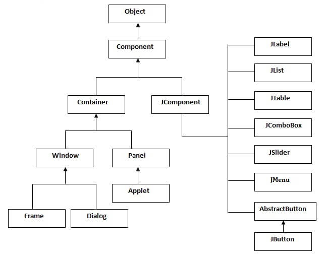
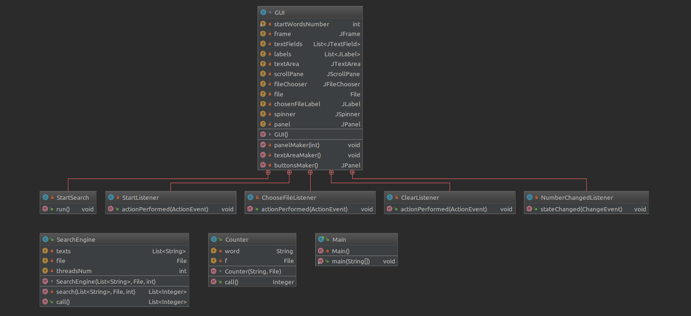

# TextSearcher

Window application for counting the number of occurrences of entered words.  
It is base on Java language, which provides built-in support for multithreading  
  
## Swing structure  
  
  
  
## UML Diagram    

